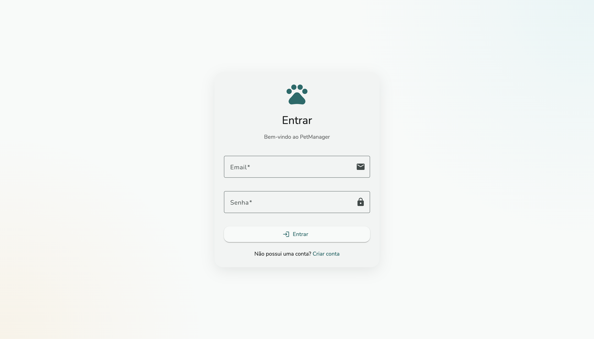
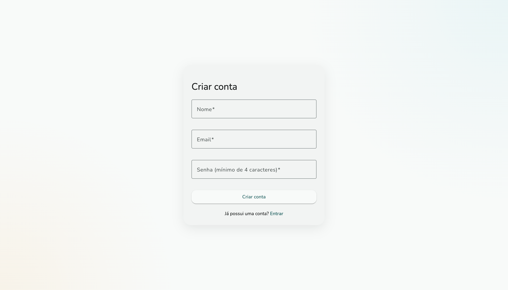
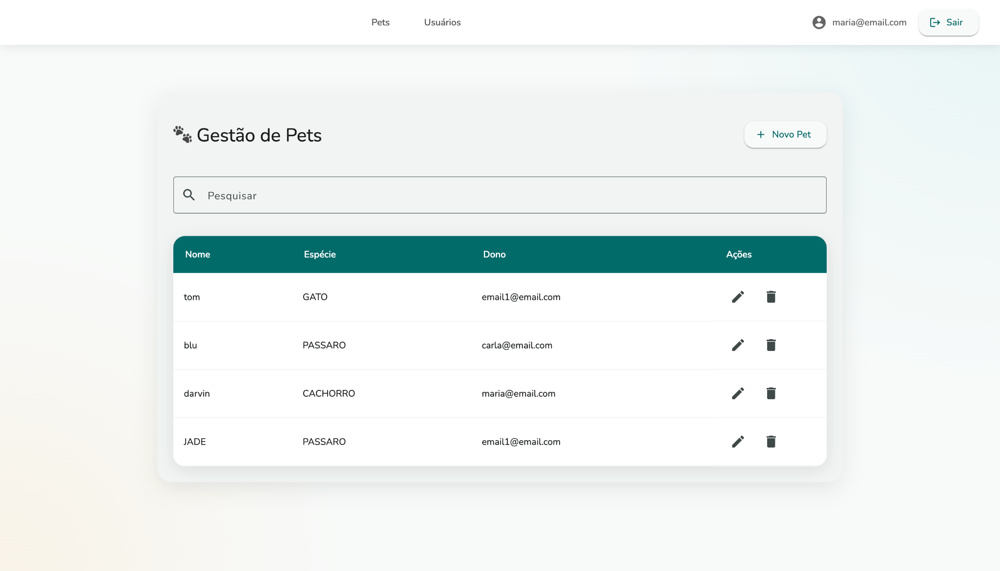
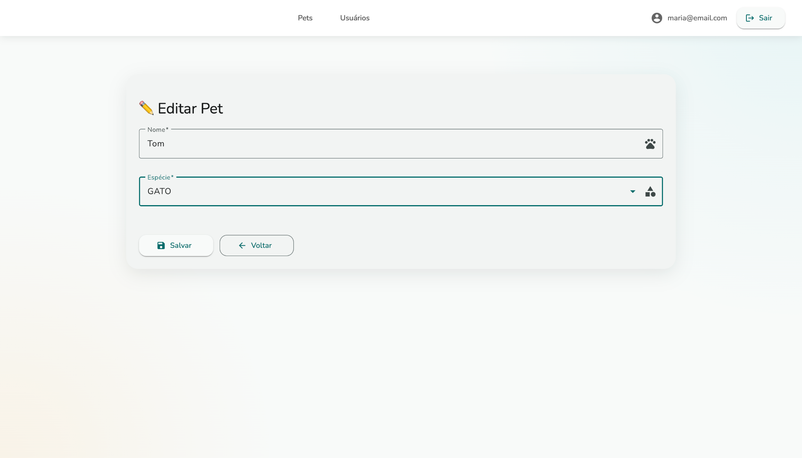
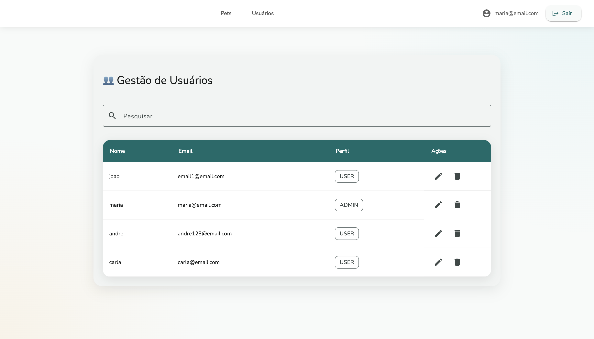
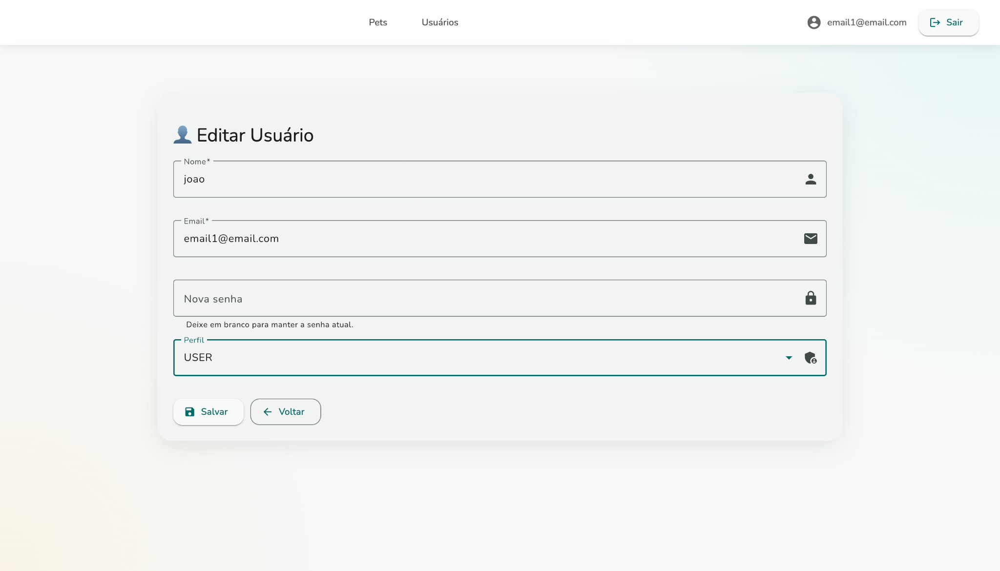
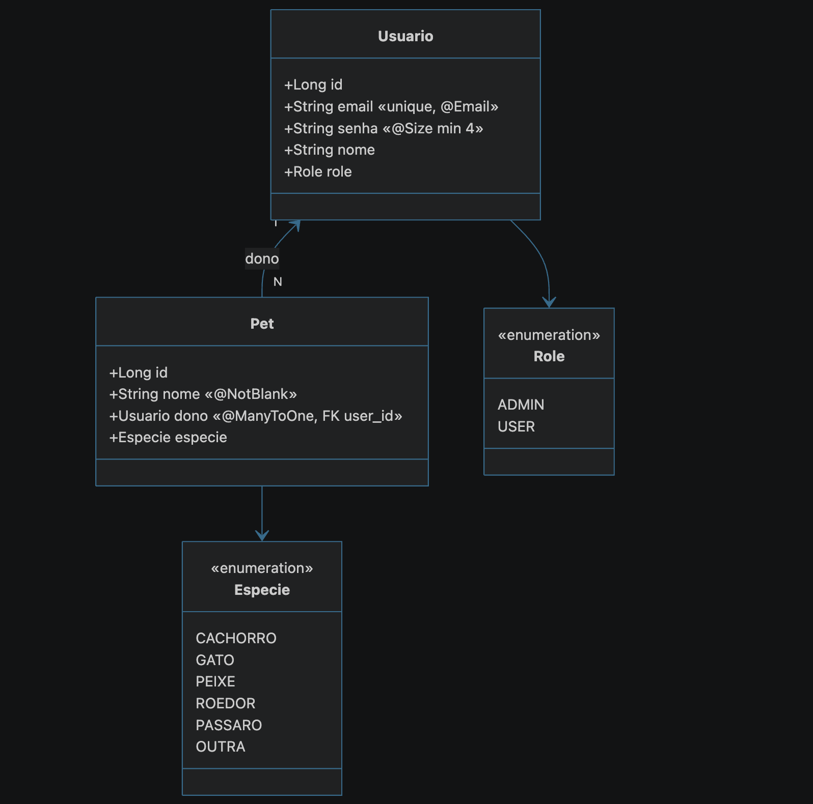
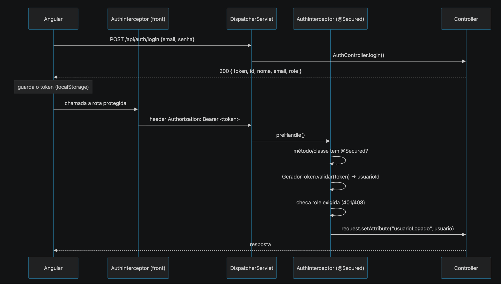

<div align="center">

# 🐾 Sistema de Gerenciamento de Usuários e Pets

**Sistema full-stack**

Spring Boot · Angular · MySQL

[](#-stack-tecnológica)
[](#-stack-tecnológica)
[](#-stack-tecnológica)
[](#-stack-tecnológica)
[](#-licença)

[Visão geral](#-visão-geral) ·
[Arquitetura](#-arquitetura) ·
[Como rodar](#-como-rodar) ·
[API](#-referência-da-api) ·
[Roadmap](#-limitações-conhecidas--próximos-passos)

</div>

---

## 📋 Sumário

- [Visão geral](#-visão-geral)
- [Arquitetura](#-arquitetura)
- [Stack tecnológica](#-stack-tecnológica)
- [Estrutura de pastas](#-estrutura-de-pastas)
- [Modelo de dados](#-modelo-de-dados)
- [Autenticação e autorização](#-autenticação-e-autorização)
- [Como rodar](#-como-rodar)
- [Referência da API](#-referência-da-api)
- [Banco de dados](#-banco-de-dados)
- [Limitações conhecidas / próximos passos](#-limitações-conhecidas--próximos-passos)
- [Contribuindo](#-contribuindo)
- [Licença](#-licença)

---

## 📖 Visão geral

O **PetManager** é uma aplicação web full-stack para gerenciamento de usuários e seus pets, com controle de acesso baseado em papéis (**ADMIN** / **USER**).

- 🔧 **Back-end**: API REST em **Spring Boot**, empacotada como **WAR** e implantada em um **Tomcat 11** externo.
- 🎨 **Front-end**: **Angular** (standalone components) com **Angular Material**, consumindo a API via `HttpClient`.
- 🗄️ **Persistência**: **MySQL** via **Spring Data JPA**.
- 🔐 **Segurança**: autenticação por **token opaco (UUID)** tipo `Bearer`, com controle de acesso por **role**.

---
## 📸 Imagens
 
<details>
<summary>Clique para expandir as capturas de tela do sistema</summary>
<br>

**Tela de login**


**Criar usuário** 


**Gestão de Pets**


**Tela de edição de pet**


**Gestão de Usuários**


**Tela de edição de usuário**


</details>

---

## 🏗 Arquitetura

```
Angular (Standalone Components + Material)
        │
        ▼
HttpClient + AuthInterceptor
  (injeta Authorization: Bearer token)
        │
        ▼
DispatcherServlet  /api/*
        │
        ▼
AuthInterceptor (@Secured)
  valida token e role
        │
        ▼
Controllers REST (Auth / Usuario / Pet)
        │
        ▼
Services (regras de negócio + @Transactional)
        │
        ▼
Repositories (Spring Data JPA)
        │
        ▼
JPA / Hibernate
        │
        ▼
     MySQL
```

**Padrão em camadas:** `controller → service → repository → model`, com pacotes de apoio `security`, `config` e `util`.

<details>
<summary>📜 Camadas do back-end (clique para expandir)</summary>

- **Controllers** (`@RestController`) — expõem os endpoints e delegam para os services. Ex.: `PetController` tem `@Secured` na classe (todos os endpoints exigem autenticação) e injeta `PetService` via `@Autowired`.
- **Services** (`@Service`) — regras de negócio, permissão e transações.

  ```java
  // ADMIN vê todos; USER vê só os seus
  public List<Pet> getAllPets(HttpServletRequest request) {
      Usuario logado = logado(request);
      if (logado.getRole() == Role.ADMIN) return petRepository.findAll();
      return petRepository.findByDono_Id(logado.getId());
  }

  @Transactional
  public Pet createPet(Pet pet, HttpServletRequest request) {
      pet.setDono(logado(request)); // o dono é SEMPRE quem criou
      pet.setId(null);
      return petRepository.save(pet);
  }
  ```

- **Repositories** (Spring Data JPA) — interfaces que estendem `JpaRepository<Entidade, Long>`; o Spring gera a implementação a partir do nome do método.

  ```java
  public interface UsuarioRepository extends JpaRepository<Usuario, Long> {
      Optional<Usuario> findByEmail(String email);   // SELECT ... WHERE email = ?
  }
  public interface PetRepository extends JpaRepository<Pet, Long> {
      List<Pet> findByDono_Id(Long donoId);           // pets de um dono
  }
  ```

- **Config** — `Application` (classe de bootstrap Spring Boot) e `GlobalExceptionHandler` (`@RestControllerAdvice`) para tratamento centralizado de erros → respostas HTTP consistentes.

</details>

---

## 🧰 Stack tecnológica

| Camada | Tecnologia |
|--------|------------|
| Linguagem (back) | Java 17+ |
| Framework (back) | Spring Boot (`spring-boot-starter-web`, `-data-jpa`, `-validation`, `-tomcat`) |
| Namespace | Jakarta (`jakarta.persistence`, `jakarta.validation`) |
| ORM / dados | Spring Data JPA + Hibernate |
| Banco | MySQL (`mysql-connector-j`) |
| Build (back) | Maven · empacotamento **WAR** (`finalName: tela-login-angular`) |
| Servidor | Tomcat 11 externo |
| Front-end | Angular (standalone components), Angular Material, TypeScript |
| Build (front) | Angular CLI (`ng serve` / `ng build`) |

> ⚠️ **Atenção:** versões antigas deste projeto usavam Spring MVC puro + Weld/CDI. Isso foi **substituído por Spring Boot** — não há mais Weld/CDI. Ao encontrar menções a "Spring MVC" ou "CDI" em textos antigos, considere desatualizado.

---

## 📂 Estrutura de pastas

```
tela-login-angular/
├── pom.xml                       # build do back-end (Spring Boot, WAR)
├── package.json                  # script "dev" (roda back + front juntos)
├── src/main/java/
│   ├── config/                   # Application (main), GlobalExceptionHandler
│   ├── controller/                # AuthController, UsuarioController, PetController, SpaFallbackController
│   ├── model/                    # Usuario, Pet, Role, Especie
│   ├── repository/               # UsuarioRepository, PetRepository (Spring Data)
│   ├── security/                 # GeradorToken, AuthInterceptor, Secured
│   └── service/                  # UsuarioService, PetService
├── src/main/resources/           # application.properties, etc.
└── angular-frontend/src/app/
    ├── login/ · criar-usuario/           # telas de autenticação
    ├── gestao-pets/ · pet-form/          # CRUD de pets
    ├── gestao-usuarios/ · usuario-form/  # CRUD de usuários
    ├── services/                         # auth.service, pet, usuario (HttpClient)
    ├── guards/                           # auth-guard, admin-guard, login-guard
    ├── interceptors/                     # auth.interceptor (Bearer token)
    └── app.routes.ts                     # rotas + guards
```

---

## 🗃 Modelo de dados




- **`Usuario`** — tabela `usuario`; `email` é único; validações Bean Validation (`@NotBlank`, `@Email`, `@Size`).
- **`Pet`** — tabela `pet`; relacionamento **N:1** com `Usuario` via FK `user_id`; `especie` persistida como `String` (`@Enumerated(EnumType.STRING)`).
- `id` gerado com `GenerationType.IDENTITY` (auto-incremento). `equals`/`hashCode` baseados no `id`.

---

## 🔐 Autenticação e autorização




- **`GeradorToken`** — gera um `UUID` no login e guarda `token → idUsuário` em memória (`ConcurrentHashMap`); `validar()` e `invalidar()` (logout).
- **`@Secured`** — anotação própria: `@Secured` = qualquer usuário logado; `@Secured(Role.ADMIN)` = só ADMIN.
- **`AuthInterceptor`** (`HandlerInterceptor`) — roda antes do controller: exige `Authorization: Bearer`, valida o token, carrega o usuário, confere a role e injeta `usuarioLogado` no request.
- No **front-end**, o `auth.interceptor.ts` injeta o header automaticamente, e os **guards** (`auth-guard`, `admin-guard`, `login-guard`) replicam as regras de role nas rotas do Angular.

---

## 🚀 Como rodar

### Pré-requisitos

- Java 17+
- Node.js + npm
- Maven
- MySQL rodando localmente (ou acessível pela `spring.datasource.url`)

### Desenvolvimento (back-end + front-end juntos)

```bash
npm run dev
```

O script `dev` (em `package.json`) usa `concurrently` para rodar `mvn spring-boot:run` (API) e `ng serve` (Angular) ao mesmo tempo.

### Produção (WAR no Tomcat)

1. Buildar o Angular: cd angular-frontend && ng build.
2. Copiar todos os arquivos gerados em angular-frontend/dist para src/main/resources/static (observação: os arquivos devem estar diretamente dentro da pasta static, não deve haver nenhuma outra subpasta).
3. Gerar o WAR: mvn clean package → target/tela-login-angular.war.
4. Executar através do Tomcat.

---

## 📡 Referência da API

Prefixo base: `/api`. **Protegido = sim** exige o header `Authorization: Bearer <token>`.

| Método | Rota | Protegido | Descrição |
|--------|------|:---------:|-----------|
| `POST` | `/api/auth/login` | Não | Autentica; retorna token + dados do usuário |
| `POST` | `/api/auth/logout` | Bearer | Invalida o token |
| `GET` | `/api/auth/me` | Sim | Retorna o usuário autenticado |
| `POST` | `/api/usuario` | Não | Cadastro público de usuário (role forçada = USER) |
| `GET` | `/api/usuario/all` | Sim (ADMIN) | Lista todos os usuários |
| `GET` | `/api/usuario/{id}` | Sim | Busca usuário (ADMIN ou o próprio) |
| `PUT` | `/api/usuario` | Sim | Atualiza usuário (ADMIN ou o próprio) |
| `DELETE` | `/api/usuario/{id}` | Sim | Exclui usuário (cascata nos pets) |
| `GET` | `/api/pet/all` | Sim | Lista pets (ADMIN: todos; USER: os seus) |
| `GET` | `/api/pet/{id}` | Sim | Busca pet (ADMIN ou dono) |
| `POST` | `/api/pet` | Sim | Cria pet (dono = usuário logado) |
| `PUT` | `/api/pet` | Sim | Atualiza pet (ADMIN ou dono) |
| `DELETE` | `/api/pet/{id}` | Sim | Exclui pet (ADMIN ou dono) |

> Confira as rotas exatas em `controller/**` — esta tabela reflete o estado atual do código, mas **o código é sempre a referência final**.

---

## 🗄 Banco de dados

Configuração em `src/main/resources/application.properties`:

| Propriedade | Descrição |
|---|---|
| `spring.datasource.url` | conexão MySQL (ex.: `jdbc:mysql://localhost:3306/...`) |
| `spring.jpa.hibernate.ddl-auto` | geração do schema (ex.: `create` recria o banco a cada start; em produção use `validate`/`none`) |
| `spring.jpa.show-sql` / `format_sql` | log das queries |

> ⚠️ Com `ddl-auto=create`, os dados são apagados a cada reinício. **Confirme o valor antes de usar em ambiente com dados reais.**

---

## 🛣 Limitações conhecidas / próximos passos

- [ ] **Senha em texto puro.** `UsuarioService.getUsuarioByEmailAndSenha` compara `senha` diretamente (`.equals`). Falta **hashing (BCrypt)**.
- [ ] **Token sem expiração e em memória.** `GeradorToken` guarda tokens num `ConcurrentHashMap` — some no restart do servidor e não expira. Evoluir para **JWT com expiração** (ou store persistente).
- [ ] **Entidade exposta na API.** `GET /auth/me`, `/usuario/all` e `/usuario/{id}` retornam a entidade `Usuario` **com o campo `senha`** no JSON. Falta **DTO de resposta** (sem senha). *(O login já monta um `Map` sem a senha — falta aplicar o mesmo cuidado no resto.)*
- [ ] **Sem testes automatizados** cobrindo services/controllers (há apenas `.spec.ts` gerados no front). Introduzir **JUnit + testes de integração** no back-end.
- [ ] **`updatePet` confia no `dono`** vindo do payload ao checar permissão — revisar para reforçar o dono a partir do usuário logado, evitando manipulação.
